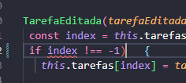

Link do Github: 
https://github.com/felipemkk/TestePraticoListaTarefasAngular#

-> Para marcar uma tarefa como concluída basta dar 2 cliques em qualquer lugar do container referente.
-> Para desmarcar a conclusão, basta dar 2 cliques novamente. 

OBS: Querido João, 
cheguei em casa, fiz o download do arquivo rar mas ele também não contem a pasta do projeto.
Porém nesse link conseguimos acessar o projeto.
A única atualização que eu fiz (como você pode conferir nos commits do git) foi a atualização do link do projeto aqui no readme.
Ah, quando você chegou e disse que o tempo acabou fiquei mais nervoso ainda e não abri um parênteses de uma função que eu criei.
Peço encarecidamente que deixe eu atualizar isso também.

Peço desculpas por não ter criado o back-end.
Geralmente primeiro crio o front utilizando  um array como testes e depois crio as requisições no back.
Estava um pouco nervoso porque quero muito a vaga, também por querer caprichar demais na estilização e acabei me perdendo no tempo.
De qualquer maneira, agradeço pela atenção e te prometo que se me der a oportunidade, farei valer a pena e melhorarei no gerenciamento de tempo.
Essa vaga é importante pra mim, pra minha carreira e pra minha família. 
obs2: pelo menos fiz as tarefas bônus.

Um abraço.

